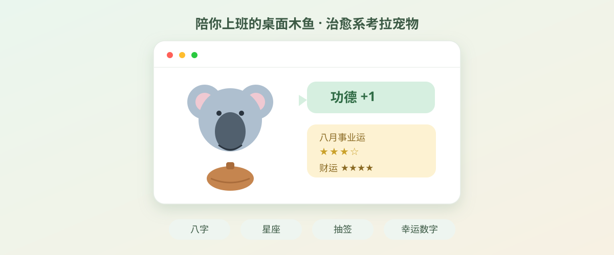
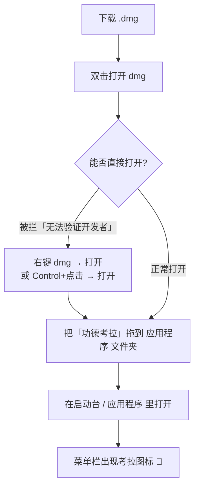
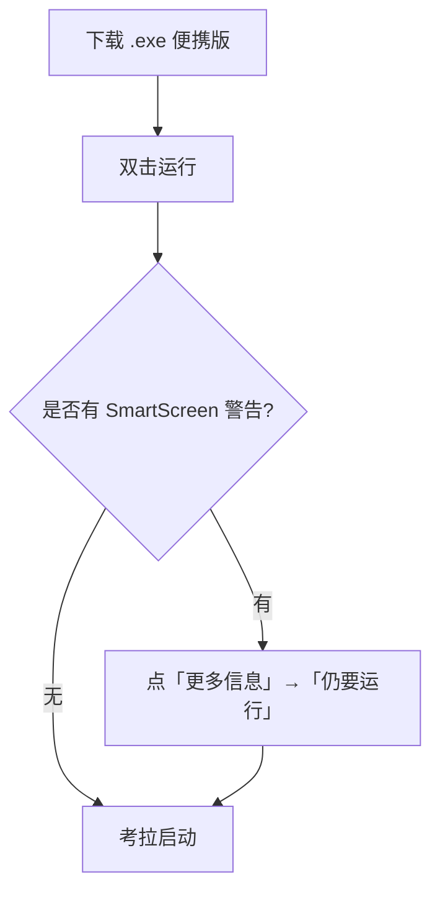
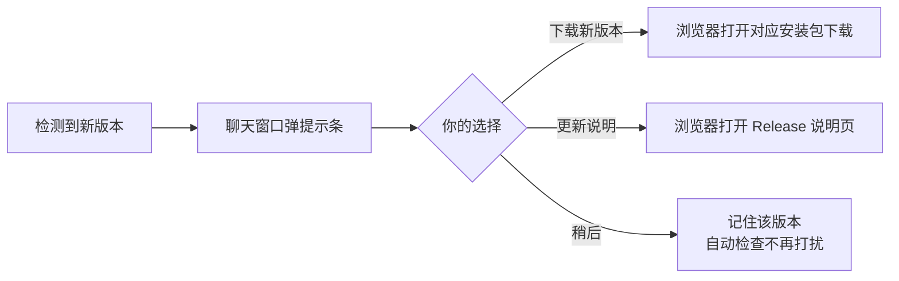

# 功德考拉 🐨

> 陪你上班的「敲木鱼」桌面宠物。一只会陪你聊天、看八字、查星座、抽签占卜的治愈系考拉。

<p align="center">
  
</p>

<p align="center">
  <a href="https://github.com/Koala-Dai/gongde-koala/releases/latest"></a>
  
  
  
</p>

---

## 📑 目录

- [这是什么](#这是什么)
- [✨ 能做什么](#-能做什么)
- [📥 下载与安装](#-下载与安装)
- [🔑 首次使用：设置 API Key](#-首次使用设置-api-key)
- [🔄 检测更新](#-检测更新)
- [❓ 常见问题（FAQ）](#-常见问题faq)
- [🛠 开发者：本地运行 / 打包 / 自动发布](#-开发者本地运行--打包--自动发布)
- [🔐 进阶：签名与公证](#-进阶签名与公证)
- [📄 协议](#-协议)

---

## 这是什么

**功德考拉**是一只趴在你桌角的虚拟考拉。工作累了就点它一下「敲木鱼，功德 +1」；想聊聊天、算算运势、抽个签，也都可以。

它常驻在屏幕角落（macOS 菜单栏 / Windows 系统托盘），不占地方、不打扰，想用的时候唤出来就好。

> 💡 这是一款**免费、开源**的小工具，代码完全公开在 [GitHub](https://github.com/Koala-Dai/gongde-koala)。

---

## ✨ 能做什么

| 功能 | 说明 |
|------|------|
| 🪵 **敲木鱼** | 点考拉随机「功德 +1」，配木鱼音效，记录今日与累计功德 |
| 💬 **AI 聊天**（多模式） | 和考拉连续对话，支持三种玩法：<br>• **八字探索**：输入生日，生成事业 / 财运 / 感情 / 情绪解读<br>• **星座运势**：问任意星座的今日 / 本月 / 今年运势<br>• **今日占卜**：能量签、抽签、AI 塔罗、幸运数字、心情测试、星座配对 |
| 📋 **内容可复制** | 聊天、占卜结果都能选中复制 |
| 🪟 **像普通窗口** | 聊天窗口可最小化 / 最大化 / 关闭，出现在 Dock / 任务栏，可 `Cmd/Ctrl+Tab` 切换 |
| 🔄 **检测更新** | 启动后自动检查新版本，也能手动检查，一键下载新版 |

---

## 📥 下载与安装

前往 **[Releases 下载页](https://github.com/Koala-Dai/gongde-koala/releases/latest)**，按你的系统下载：

| 系统 | 文件 | 适用 |
|------|------|------|
| macOS（Apple 芯片） | `功德考拉-*.dmg` | M 系列芯片（M1/M2/M3…） |
| macOS（Intel） | `功德考拉-*.dmg` | 老款 Intel Mac |
| Windows | `功德考拉-*.exe` | 便携版，下载即用，无需安装 |

### macOS 安装



> ⚠️ **第一次打开被系统拦下，是正常的**（见下方 FAQ）。本项目未购买 Apple 开发者证书，macOS 会提示「无法验证开发者」。
> 解决（任选其一）：
> 1. **右键**（或 `Control`+点击）安装包 / 应用 → 点「**打开**」；
> 2. 终端执行 `xattr -cr /Applications/功德考拉.app` 后重试。
>
> 打开过一次之后，今后就能正常启动，不再有此提示。

### Windows 安装



> Windows 版是**便携版**，下载后直接双击即可运行，不用安装。可右键任务栏图标「固定到任务栏」，方便下次打开。

---

## 🔑 首次使用：设置 API Key

**AI 聊天**功能需要你自己的 [DeepSeek API Key](https://platform.deepseek.com/)（DeepSeek 有免费额度，注册即送）。木鱼、抽签、塔罗等离线玩法**不需要** Key，开箱即用。

设置步骤：

1. 打开考拉菜单（点菜单栏 🐨 图标，或**右键考拉**）
2. 选「💬 找考拉聊天」打开聊天窗口
3. 在聊天里发「设置」，按提示填入你的 DeepSeek API Key

> 🔒 Key 只保存在你本机 `~/Library/Application Support/GongdeKoala/gongde.json`（macOS）或对应用户数据目录，**绝不上传**。

---

## 🔄 检测更新

考拉会在**启动约 5 秒后自动**检查 GitHub 上的新版本（同一版本不会重复打扰）。你也可以随时手动检查：

- **菜单检查**：考拉菜单 → 「🔄 检查更新」
- **首页检查**：聊天首页底部「🔄 检查更新」按钮

发现新版本时，聊天窗口顶部会弹出提示条：



> 💡 当前安装包未签名、Windows 为便携版，所以「更新」是**一键下载新版安装包**让你手动替换，而非后台静默安装。要做到「后台自动安装」需要苹果开发者证书（见下方进阶）。

---

## ❓ 常见问题（FAQ）

**Q：打开时提示「无法验证开发者」/ 被系统拦下，怎么办？**
A：这是正常的，因为安装包没有苹果开发者签名。macOS 请**右键（或 `Control`+点击）→ 打开**；Windows 请在 SmartScreen 处点「更多信息 → 仍要运行」。打开过一次后通常就不再拦截。详见上方安装步骤。

**Q：这个要花钱吗？**
A：软件本身**完全免费、开源**。只有 AI 聊天需要你自备 DeepSeek API Key（DeepSeek 提供免费额度，注册即得）。其他功能（敲木鱼、抽签、塔罗、星座等）都不需要任何费用。

**Q：我的聊天记录和八字信息安全吗？**
A：安全。所有数据（包括你填的生日、API Key）**只存在你自己的电脑本地**，不会上传到任何服务器。

**Q：必须填 DeepSeek Key 才能用吗？**
A：不是。敲木鱼、抽签、AI 塔罗、幸运数字、星座配对等**离线功能开箱即用**；只有「AI 聊天 / 八字解读 / 星座运势」需要联网调用 DeepSeek，才需要 Key。

**Q：怎么升级到新版本？**
A：考拉会自动检测更新并提示你一键下载；你也可以随时来 [Releases 下载页](https://github.com/Koala-Dai/gongde-koala/releases/latest) 手动下载最新版。

**Q：支持 Linux 吗？**
A：目前只提供 **macOS** 和 **Windows** 安装包。Linux 可在源码基础上自行构建（见下方开发者章节）。

---

## 🛠 开发者：本地运行 / 打包 / 自动发布

<details>
<summary>点击展开（面向开发者）</summary>

### 本地运行

```bash
git clone https://github.com/Koala-Dai/gongde-koala.git
cd gongde-koala
npm install        # 需要 Node 22
npm start          # 开发模式启动
npm run dev        # 带日志启动
```

> 国内网络下，仓库根目录 `.npmrc` 已配置 npmmirror 镜像加速 Electron 下载；CI / 海外环境若下载慢可临时注释其中的 mirror 行。

### 目录结构

```
src/
  main/        主进程：窗口、托盘、聊天 API、数据、更新检测
  renderer/    渲染进程：桌宠动画 + 聊天界面
  shared/      八字排盘、玄学娱乐数据引擎
assets/        考拉精灵图、木鱼音效、图标源、README 头图
scripts/       精灵图 / 托盘图标构建脚本
build/         打包用图标（icns / png）
```

### 本地打包

```bash
npm run build:mac    # 输出 dist/*.dmg（arm64 + x64）
npm run build:win    # 输出 dist/*.exe（Windows 便携版）
npm run build:all    # 同时打 mac + win
```

### 自动发布（CI）

仓库已配置 GitHub Actions（`.github/workflows/release.yml`）：打 `v*` 标签并推送，即在 macOS / Windows runner 上自动构建并发布到 Releases。

```bash
git tag v0.1.2 && git push origin v0.1.2
```

</details>

---

## 🔐 进阶：签名与公证

当前 macOS 安装包**未签名、未公证**，所以下载后需右键打开。要做到「下载即双击安装、零警告」，需要：

1. 加入 [Apple Developer Program](https://developer.apple.com/programs/)（每年 $99）
2. 申请 **Apple Distribution** + **Developer ID Application** 证书
3. 在 CI 配置 `CSC_LINK`（证书 p12）和 `CSC_KEY_PASSWORD`，让 electron-builder 自动签名
4. 再对产物做 `notarize`（公证）上传 Apple 验证

这部分需要你提供证书，目前尚未配置。签名后「检测更新」也能升级为「后台静默自动安装」。

---

## 📄 协议

基于 [ISC](./LICENSE) 协议开源。
