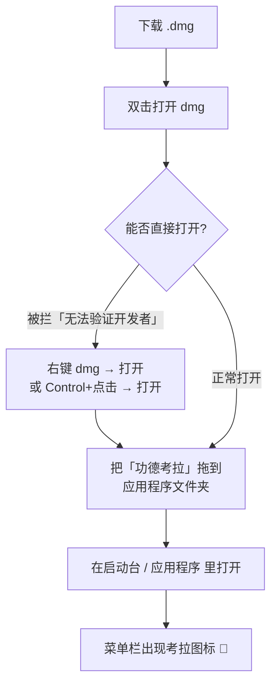
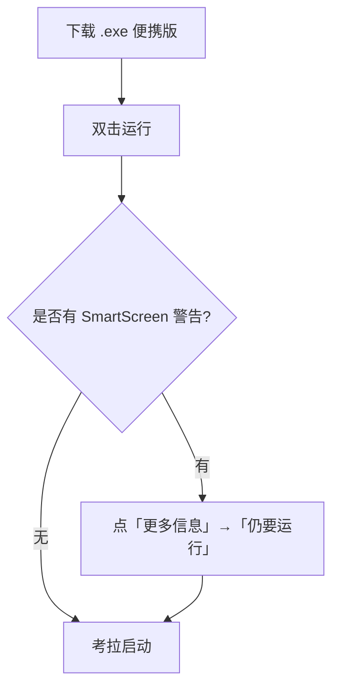

# 功德考拉 🐨

陪你上班的「敲木鱼」桌面宠物。一只会陪你聊天、看八字、查星座、抽签占卜的治愈系考拉。

基于 **Electron 43 + ESM** 构建，常驻菜单栏（macOS）或系统托盘（Windows），无边框卡片风格，像一只趴在桌角的小宠物。

---

## ✨ 功能

- 🪵 **敲木鱼**：点击考拉随机功德 +1，配木鱼音效，记录今日功德与累计功德
- 🔮 **玄学聊天**（多模式，支持连续对话）
  - 八字探索：输入生日排盘，生成「修行报告」式解读（事业 / 财运 / 感情 / 情绪）
  - 星座运势：问任意星座的今日 / 本月 / 今年运势（不会把「八月」答成「今日」）
  - 今日占卜：能量签、抽签、AI 塔罗三选一、幸运数字、心情测试、星座配对
- 💬 **可复制**：聊天内容、占卜结果均可选中复制
- 🪟 **像普通窗口**：聊天窗口可最小化 / 最大化 / 关闭，出现在 Dock / 任务栏，可 `Cmd+Tab` 切换
- 🔄 **检测更新**：启动后自动检查新版本，也可在菜单 / 首页手动检查，一键下载新版

---

## 📦 下载与安装

去 **[Releases](../../releases)** 页面，按你的系统下载对应安装包：

| 系统 | 文件 | 说明 |
|------|------|------|
| macOS（Apple 芯片） | `功德考拉-0.1.1-arm64.dmg` | M 系列芯片 |
| macOS（Intel） | `功德考拉-0.1.1.dmg` | 老款 Intel Mac |
| Windows | `功德考拉-0.1.1.exe` | 便携版，无需安装 |

### macOS 安装流程



> ⚠️ **macOS 打开提示**：本项目未购买 Apple 开发者证书，首次打开会提示「无法验证开发者」。
> 解决（任选其一）：
> 1. 右键（或 `Control`+点击）安装包 / 应用 → **打开**；
> 2. 终端执行 `xattr -cr /Applications/功德考拉.app` 后重试。
>
> 之后即可正常启动，不再有此提示。

### Windows 安装流程



> Windows 便携版（`.exe`）不需要安装，下载后直接双击即可运行；可自己把它固定到任务栏方便下次打开。

---

## 🔑 首次使用：设置 API Key

AI 聊天功能依赖 [DeepSeek API](https://platform.deepseek.com/)。首次使用需填入你自己的 Key：

1. 打开考拉菜单（点菜单栏 🐨 图标，或**右键考拉**）
2. 选择「💬 找考拉聊天」打开聊天窗口
3. 在聊天里发送「设置」或直接在菜单中找到「设置」入口，填入 DeepSeek API Key

> 🔒 Key 只保存在你本机 `~/Library/Application Support/GongdeKoala/gongde.json`（macOS）或对应用户数据目录，**不会上传**。

---

## 🔄 检测更新

考拉会**启动 5 秒后自动**检查 GitHub 上是否有新版本（同一版本不会重复打扰）。你也可以随时手动检查：

- **菜单检查**：考拉菜单 → 「🔄 检查更新」
- **首页检查**：聊天首页底部「🔄 检查更新」按钮

发现新版本时，聊天窗口顶部会弹出提示条：


> 💡 当前安装包未签名、Windows 为便携版，因此「更新」是**一键下载新版安装包**而非后台静默替换。
> 实现真正的「后台自动安装」需要苹果开发者证书做签名 + 公证（见下方「进阶」）。

---

## 🛠 本地开发

```bash
# 克隆
git clone https://github.com/Koala-Dai/gongde-koala.git
cd gongde-koala

# 安装依赖（需要 Node 22）
npm install

# 启动（开发模式）
npm start

# 带日志启动
npm run dev
```

> 若在国内，仓库根目录 `.npmrc` 已配置 npmmirror 镜像以加速 Electron 下载。
> 若 CI / 海外环境下载慢，可临时注释 `.npmrc` 中的 mirror 行。

### 目录结构

```
src/
  main/        主进程：窗口、托盘、聊天 API、数据、更新检测
  renderer/    渲染进程：桌宠动画 + 聊天界面
  shared/      八字排盘、玄学娱乐数据引擎
assets/
  koala/       考拉精灵图（运行时加载）
  audio/       木鱼音效
  icon-*       应用图标源
scripts/       精灵图 / 托盘图标构建脚本
build/         打包用图标（icns / png）
```

---

## 📦 打包

```bash
npm run build:mac    # 输出 dist/*.dmg（arm64 + x64）
npm run build:win    # 输出 dist/*.exe（Windows 便携版）
npm run build:all    # 同时打 mac + win
```

打包产物在 `dist/`，已被 `.gitignore` 忽略，不会进仓库。

---

## 🚀 自动发布（CI）

仓库已配置 GitHub Actions（`.github/workflows/release.yml`）：

1. 在本地改完代码并 `git commit`
2. 打标签并推送：`git tag v0.1.1 && git push origin v0.1.1`
3. GitHub 自动在 macOS / Windows runner 上构建
4. 构建产物自动发布到 **Releases**，任何人都能下载；已安装的用户下次启动会收到更新提示

> ⚠️ 标签必须形如 `v*`（如 `v0.1.1`）才会触发构建。

---

## 🔐 进阶：签名与公证（消除 Gatekeeper 警告）

当前 macOS 安装包**未签名、未公证**，所以下载后需右键打开。要做到「下载即双击安装、无警告」，需要：

1. 加入 [Apple Developer Program](https://developer.apple.com/programs/)（每年 $99）
2. 申请 **Apple Distribution** 证书 + **Developer ID Application** 证书
3. 在 CI 里配置 `CSC_LINK`（证书 p12）和 `CSC_KEY_PASSWORD`，让 electron-builder 自动签名
4. 再做 `notarize`（公证）上传到 Apple 验证

这部分需要你提供证书，目前尚未配置。签名后「检测更新」也能升级为「后台静默自动安装」。

---

## 📄 协议

[ISC](./LICENSE)
